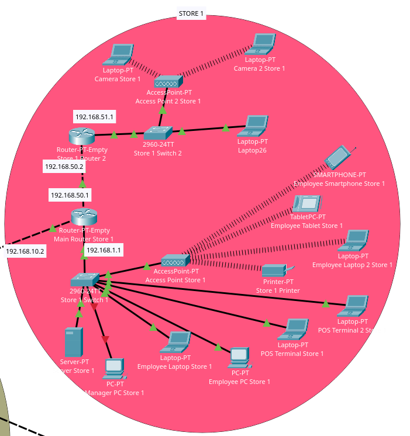
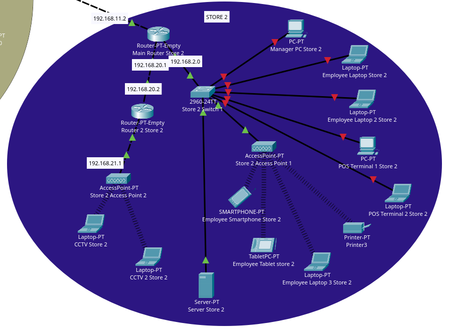
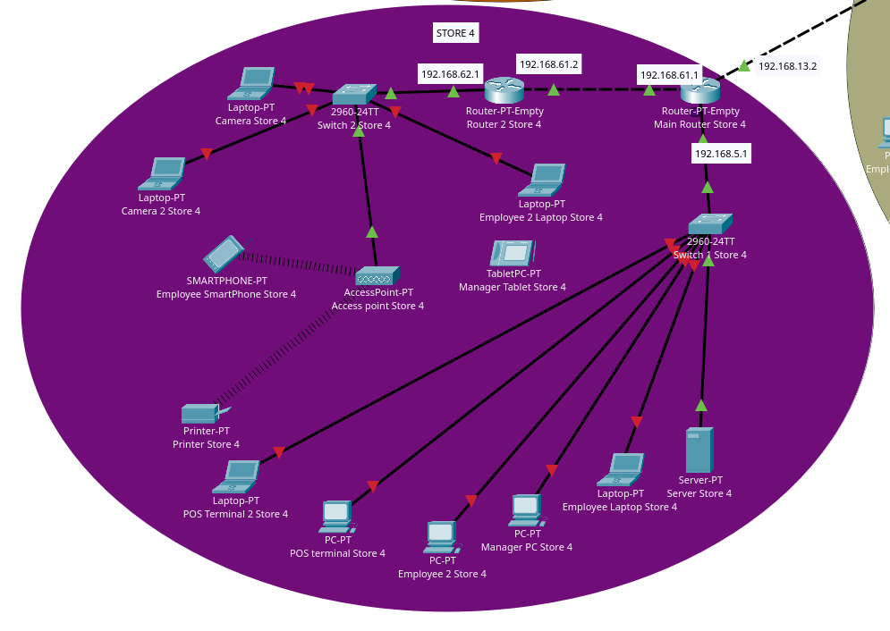
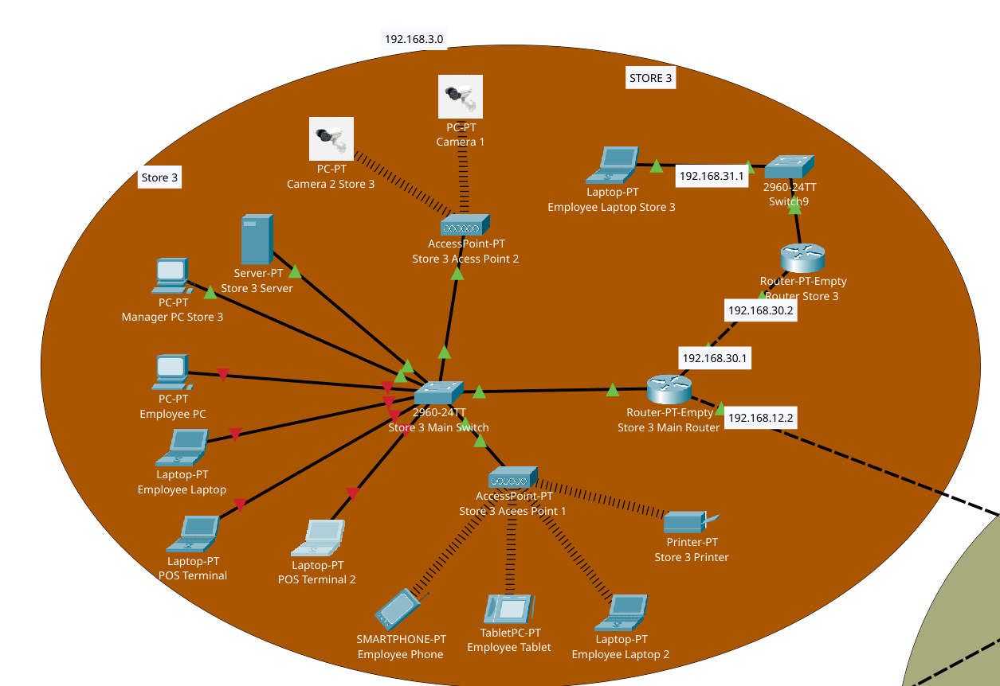
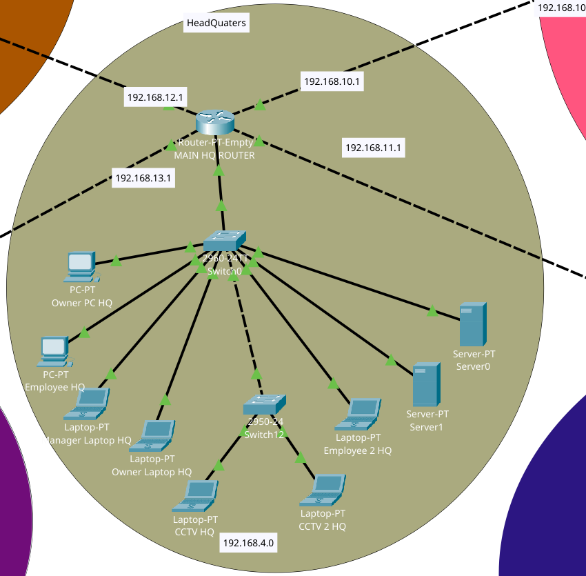
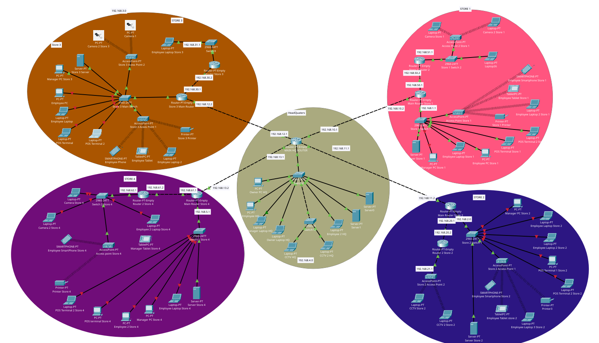

## Table of Contents

1. [Introduction](#1-introduction)
2. [Network Topology Overview](#2-network-topology-overview)
3. [Technologies Used](#3-technologies-used)
4. [Routing Protocols and Configuration](#4-routing-protocols-and-configuration)
   - 4.1 [RIP – Store 1](#41-rip--store-1)
   - 4.2 [EIGRP – Store 2 and Store 4](#42-eigrp--store-2-and-store-4)
   - 4.3 [OSPF – Store 3](#43-ospf--store-3)
5. [Redistribution at Headquarters Router](#5-redistribution-at-headquarters-router)
6. [DHCP Configuration for Stores and HQ](#6-dhcp-configuration-for-stores-and-hq)
7. [Network Address Translation (NAT) at Store 1](#7-network-address-translation-nat-at-store-1)
8. [Firewall Configuration and Security](#8-firewall-configuration-and-security)
9. [Challenges Faced](#9-challenges-faced)
10. [Network Topology Diagram](#10-network-topology-diagram)
11. [Conclusion](#11-conclusion)

---

## 1. Introduction

The **Retail Chain Network Design** project involves creating a detailed network topology for a retail chain consisting of four stores and a headquarters (HQ). This network was designed and simulated using **Cisco Packet Tracer**. The design incorporates a variety of networking components — including routers, switches, servers, firewalls, and end devices — ensuring secure, reliable, and scalable connectivity between all locations.

The project focuses on the implementation of:
- **Routing Protocols** for inter-store and HQ traffic management
- **NAT (Network Address Translation)** for IP address masking
- **DHCP (Dynamic Host Configuration Protocol)** for dynamic IP assignment
- **Firewall Rules** for securing sensitive devices such as POS terminals and CCTV cameras

### Objectives

- Efficient communication between stores and HQ
- Implementation of routing protocols to manage inter-store traffic
- Security enforcement for sensitive devices within each store
- Dynamic IP address assignment via DHCP servers
- Internal IP address protection via NAT
- Firewall-based restriction of unauthorized access

---

## 2. Network Topology Overview

The network consists of the following components:

| Component | Description |
|-----------|-------------|
| **Four Stores** | Each store includes two routers (for redundancy), switches, access points, end devices (laptops, printers, POS terminals, CCTV cameras), and a DHCP server |
| **Headquarters (HQ)** | Central hub responsible for routing traffic between all stores |
| **DHCP Servers** | Each store and HQ have dedicated DHCP servers for dynamic IP assignment |
| **Routing Protocols** | Different protocols are used per store (see below) |

### Routing Protocol Assignment

| Location | Protocol |
|----------|----------|
| Store 1 | RIP (Routing Information Protocol) |
| Store 2 | EIGRP (Enhanced Interior Gateway Routing Protocol) |
| Store 3 | OSPF (Open Shortest Path First) |
| Store 4 | EIGRP (Enhanced Interior Gateway Routing Protocol) |

---

## 3. Technologies Used

| Technology | Purpose |
|------------|---------|
| **Cisco Packet Tracer** | Network simulation, configuration, and testing |
| **RIP** | Routing protocol for Store 1 |
| **EIGRP** | Routing protocol for Store 2 and Store 4 |
| **OSPF** | Routing protocol for Store 3 |
| **DHCP** | Dynamic IP address assignment at all stores and HQ |
| **NAT** | Applied at Store 1 to allow internal devices to share public IP addresses |
| **Firewall** | Secures POS terminals and CCTV cameras from unauthorized access |
| **IP Helper Address** | Configured on routers to forward DHCP Discover packets across subnets |

---

## 4. Routing Protocols and Configuration

Routing is the backbone of communication between stores and HQ. Each store uses two routers to ensure fault tolerance and redundancy. Different routing protocols are deployed per store to exchange routing information and optimize traffic flow.

---

### 4.1 RIP – Store 1

**RIP (Routing Information Protocol)** is a distance-vector protocol that updates routing tables by broadcasting the full table to neighboring routers. It is simple to configure and well-suited for smaller networks.



#### Configuration Details

- **Routing Protocol:** RIP
- **Routers:** Two routers exchange RIP updates to ensure communication between Store 1 devices and HQ

#### Router Configuration


```

Router(config)# router rip
Router(config-router)# network 192.168.1.0
Router(config-router)# network 192.168.10.0
Router(config-router)# network 192.168.50.0

```

---

### 4.2 EIGRP – Store 2 and Store 4

**EIGRP (Enhanced Interior Gateway Routing Protocol)** is a hybrid routing protocol that combines characteristics of both distance-vector and link-state protocols. It uses a composite metric based on bandwidth, delay, reliability, and load, making it highly efficient and scalable for larger networks.

#### Configuration Details

- **Routing Protocol:** EIGRP
- **Routers:** Each store uses two routers configured with EIGRP for reliable communication with HQ

#### Store 2 Router Configuration




```

Router(config)# router eigrp 1
Router(config-router)# network 192.168.20.0 0.0.0.255
Router(config-router)# network 192.168.11.0 0.0.0.255
Router(config-router)# network 192.168.2.0 0.0.0.255

```

#### Store 4 Router Configuration




```

Router(config)# router eigrp 1
Router(config-router)# network 192.168.5.0 0.0.0.255
Router(config-router)# network 192.168.13.0 0.0.0.255
Router(config-router)# network 192.168.61.0 0.0.0.255

```

---

### 4.3 OSPF – Store 3

**OSPF (Open Shortest Path First)** is a link-state routing protocol that uses cost (based on bandwidth) as its metric. It offers faster convergence and greater scalability compared to RIP, making it suitable for medium-to-large networks.

#### Configuration Details

- **Routing Protocol:** OSPF (Area 0, Area 3)
- **Routers:** Two routers at Store 3 exchange OSPF link-state advertisements to maintain an updated network topology

#### Store 3 Router Configuration




```

Router(config)# router ospf 1
Router(config-router)# network 192.168.3.0 0.0.0.255 area 3
Router(config-router)# network 192.168.30.0 0.0.0.255 area 3
Router(config-router)# network 192.168.12.0 0.0.0.255 area 0

```

---

## 5. Redistribution at Headquarters Router

Route redistribution enables the HQ router to share routing information across different routing protocols, ensuring seamless communication between all stores regardless of the protocol in use.



Redistribution was configured on the HQ router to bridge communication between:
- **Store 1** (RIP)
- **Store 3** (OSPF)
- **Store 2 & Store 4** (EIGRP)

#### HQ Router Configuration


```

HeadquartersRouter(config)# router ospf 1
HeadquartersRouter(config-router)# redistribute rip metric 10
HeadquartersRouter(config-router)# redistribute eigrp 100 metric 10

```

---

## 6. DHCP Configuration for Stores and HQ

Each store and the HQ are equipped with dedicated DHCP servers that automatically assign IP addresses to connected devices, eliminating the need for manual configuration.

#### Configuration Details

| Component | Description |
|-----------|-------------|
| **DHCP Servers** | Each store and HQ has its own DHCP server |
| **IP Address Pools** | Address ranges are configured according to each location's network subnet |
| **IP Helper Address** | Configured on routers to relay DHCP Discover packets across subnet boundaries |

---

## 7. Network Address Translation (NAT) at Store 1

NAT is implemented at Store 1 to allow multiple internal devices to share a pool of public IP addresses when communicating with external networks. This adds a layer of security by masking internal IP addresses from external entities.

#### Configuration Details

| Parameter | Value |
|-----------|-------|
| **NAT Type** | Dynamic NAT (IP address pool) |
| **Purpose** | Translates internal private IPs to public IPs from a pre-configured pool |
| **Scope** | Applied at Store 1 routers |

Dynamic NAT is configured so that internal devices can access external resources while their private IP addresses remain hidden. Public IPs are dynamically assigned from the pool as needed.

---

## 8. Firewall Configuration and Security

Firewalls are implemented directly on sensitive end devices — specifically **POS terminals** and **CCTV cameras** — to prevent unauthorized access without relying solely on router-based ACLs.

#### Configuration Details

| Security Measure | Description |
|-----------------|-------------|
| **End Device Firewalls** | Each POS terminal and CCTV camera has a built-in firewall restricting external access |
| **Authorized Access Only** | Only devices within the same store network are permitted to communicate with these devices |
| **Cross-Store Isolation** | Devices from other stores or HQ cannot access POS terminals or CCTV cameras |

This approach ensures that even if an external device attempts to reach a POS terminal or CCTV camera, the on-device firewall blocks the attempt — securing the store's critical infrastructure at the device level.

---

## 9. Challenges Faced

### 9.1 Routing Protocol Compatibility and Redistribution

Ensuring proper communication between the different routing protocols (RIP, EIGRP, and OSPF) was one of the most significant challenges. Redistribution at the HQ router required careful attention to routing metrics and administrative distances to avoid routing loops or suboptimal paths. Incorrect redistribution initially caused routing inconsistencies, which were resolved by adjusting redistribution metrics to achieve optimal routing.

### 9.2 NAT Configuration

Configuring Dynamic NAT at Store 1 presented difficulties in correctly mapping internal private IP addresses to the public IP pool. The primary challenge was ensuring that internal devices could access external resources while their private IP addresses remained protected. This required precise pool configuration and interface designation.

### 9.3 Firewall Configuration

Implementing firewalls on POS terminals and CCTV cameras introduced complexity due to the interaction between **DHCP** and **UDP traffic**. The firewalls needed to:
- Allow DHCP requests transmitted over UDP
- Block unauthorized external connections simultaneously
- Support stateful packet inspection for correct handling of return traffic (particularly for DHCP lease renewals)

Resolving these issues required a thorough understanding of both network protocols and security principles to ensure the devices operated securely without service disruption.

---

## 10. Network Topology Diagram

The network topology diagram provides a visual representation of the overall network design, including routers, DHCP servers, firewalls, access points, end devices, and the interconnections between all stores and HQ.



### Network Components Summary

| Location | Components |
|----------|------------|
| **HQ** | Routers, DHCP server, redistribution configuration |
| **Store 1** | RIP routing, routers, access points, NAT, DHCP server |
| **Store 2** | EIGRP routing, routers, access points, DHCP server |
| **Store 3** | OSPF routing, routers, access points, DHCP server |
| **Store 4** | EIGRP routing, routers, access points, DHCP server |

> *Refer to the Cisco Packet Tracer simulation file for the full interactive topology diagram.*

---

## 11. Conclusion

The **Retail Chain Network Design** project successfully demonstrates the creation and configuration of a functional and secure network using Cisco Packet Tracer. By implementing multiple routing protocols, configuring NAT for secure address translation, deploying DHCP servers for dynamic IP assignment, and enforcing device-level firewall rules, the network fully meets the operational requirements of a multi-store retail chain with a central headquarters.

### Key Achievements

| Feature | Implementation |
|---------|---------------|
| **Routing** | RIP (Store 1), OSPF (Store 3), EIGRP (Store 2 & 4) with HQ redistribution |
| **Dynamic IP Assignment** | DHCP servers deployed at each store and HQ |
| **Address Translation** | Dynamic NAT at Store 1 to secure internal IP addresses |
| **Device Security** | Firewall configurations on POS terminals and CCTV cameras |
| **Redundancy** | Dual routers at every store for fault tolerance |

The resulting network is both **secure** and **scalable**, providing optimal performance and reliable inter-store communication for the retail chain.
